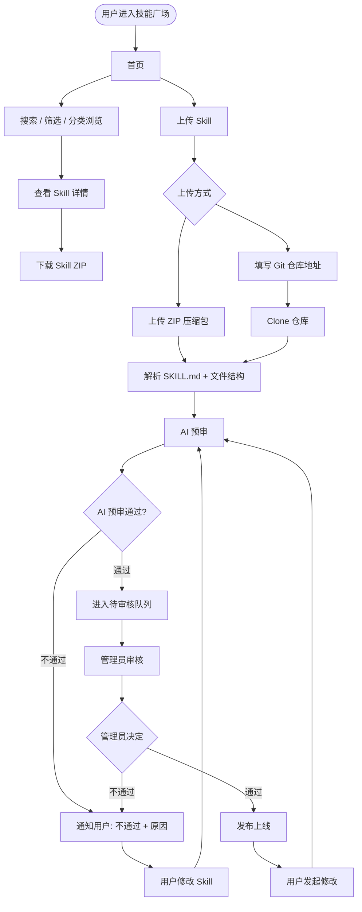
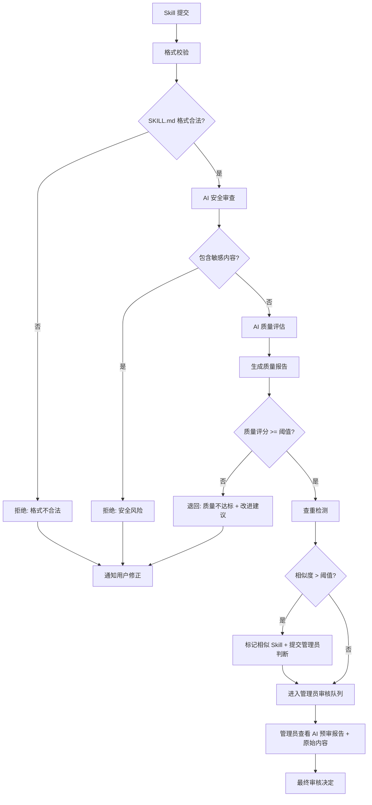
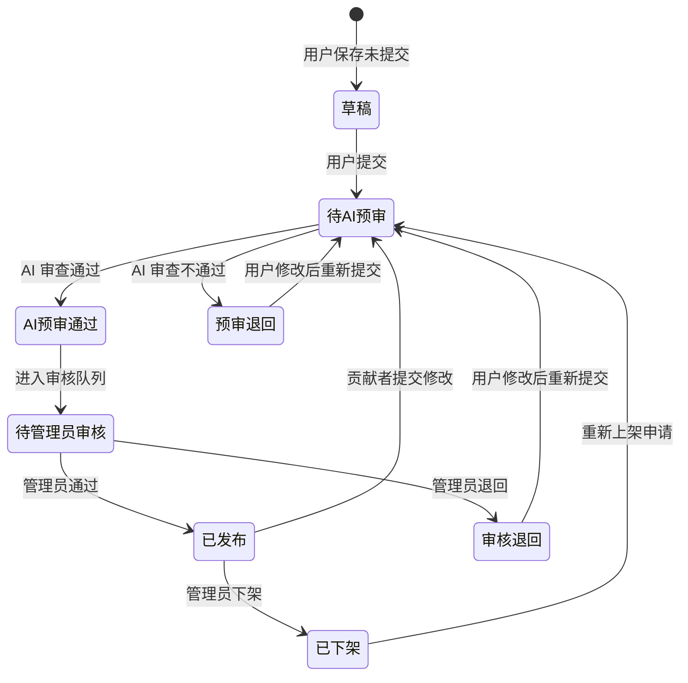

# 技能广场 — 系统流程图

> 版本：v1.1 | 日期：2026-04-15 | 状态：待确认

## 1. 系统角色与边界

> 技能广场作为技术门户系统内的功能模块，所有用户均已通过技术门户完成登录，无需在本模块内处理登录流程。

```
┌─────────────────────────────────────────────────────────┐
│                    技能广场 (Skill Hub)                    │
│                                                          │
│  ┌──────────────────────┐  ┌────────────────────────┐    │
│  │      普通用户         │  │       管理员           │    │
│  │                      │  │                        │    │
│  │ · 浏览 Skill         │  │ · 普通用户全部权限      │    │
│  │ · 搜索 / 筛选        │  │ · 审核 Skill           │    │
│  │ · 上传 Skill         │  │ · 下架 Skill           │    │
│  │ · 修改自己的 Skill    │  │ · 管理分类标签         │    │
│  │ · 下载 Skill         │  │                        │    │
│  │ · 查看审核状态       │  │                        │    │
│  └──────────────────────┘  └────────────────────────┘    │
│                                                          │
│  外部依赖:                                                │
│  · 内部 LLM API (AI 预审)                                 │
│  · Git 仓库服务 (Git 导入)                                │
└─────────────────────────────────────────────────────────┘
```

**角色说明：**

| 角色   | 权限                             | 说明         |
| ---- | ------------------------------ | ---------- |
| 普通用户 | 浏览、搜索、上传、下载、修改自己的 Skill、查看审核状态 | 系统默认角色     |
| 管理员  | 普通用户全部权限 + 审核、下架、管理分类标签        | 由系统分配的管理权限 |

## 2. 核心业务流程图



## 3. AI 预审流程



### AI 预审检查项

| 检查阶段 | 检查内容 | 不通过处理 |
|----------|----------|-----------|
| 格式校验 | SKILL.md 是否存在、YAML frontmatter 是否完整、必填字段（name/description） | 自动拒绝，通知修正 |
| 安全审查 | 是否包含敏感信息（API Key、密码、内部 IP）、是否包含恶意指令 | 自动拒绝，标记风险类型 |
| 质量评估 | 描述清晰度、指令完整性、示例充足度、格式规范性 | 退回修改 + AI 改进建议 |
| 查重检测 | 与已有 Skill 的名称/描述相似度 | 标记相似项，交管理员判断 |

## 4. Skill 数据生命周期



### 状态说明

| 状态 | 说明 | 可见性 | 可执行操作 |
|------|------|--------|-----------|
| 草稿 | 用户未提交 | 仅上传者本人 | 编辑、提交审核、删除 |
| 待 AI 预审 | 已提交，AI 审查中 | 仅上传者本人 | 等待（不可编辑） |
| 预审退回 | AI 审查不通过 | 仅上传者本人 | 查看报告、修改后重新提交 |
| 待管理员审核 | AI 通过，排队中 | 仅上传者本人 | 等待（不可编辑） |
| 审核退回 | 管理员退回修改 | 仅上传者本人 | 查看意见、修改后重新提交 |
| 已发布 | 审核通过，公开可见 | 所有用户 | 下载、上传者可发起修改 |
| 已下架 | 管理员下架 | 仅上传者和管理员 | 申请重新上架 |

## 5. 页面结构总览

```
技能广场
│
├── 首页 (/)
│   ├── 导航栏（logo、导航菜单）
│   │   ├── [按钮] 上传 Skill → 弹出上传表单
│   │   └── [按钮] 我的 Skill → 弹出我的技能列表
│   ├── 搜索栏 + 筛选器（分类/标签/排序）
│   └── 全部 Skill 列表（按上传时间正序排列，点击新窗口打开详情页）
│
├── Skill 详情页 (/skill/:id) [新窗口打开]
│   ├── 基本信息（名称、标签、贡献者、版本、下载量）
│   ├── Skill 内容（SKILL.md 渲染）
│   ├── 文件结构树
│   ├── 使用指南
│   └── 下载按钮
│
└── 管理后台 (/admin) [仅管理员]
    ├── 审核队列（待审核列表 + AI 预审报告）
    ├── 审核操作（通过/拒绝）
    ├── 已发布 Skill 管理（下架）
    └── 统计概览
```

### 页面交互说明

| 交互 | 触发方式 | 目标 |
|------|----------|------|
| 打开上传弹窗 | 点击顶部"上传 Skill"按钮 | 弹出上传表单 |
| 打开我的 Skill | 点击顶部"我的 Skill"按钮 | 弹出我的技能列表 |
| 打开详情页 | 点击首页技能列表项 | 新窗口打开详情页 |
| 排序切换 | 选择排序下拉框 | 按上传时间/下载量/名称排序 |

## 6. 技术选型

| 层级 | 技术 | 说明 |
|------|------|------|
| 前端 | React 18 + TypeScript + Vite + Tailwind CSS | SPA 单页应用 |
| 后端 | Spring Boot 3.x + Java 17 | REST API 服务 |
| 数据库 | MySQL 8.x | 关系型存储 |
| 文件存储 | 本地 / MinIO | Skill 文件和 ZIP 包存储 |
| AI | 内部 LLM API | AI 预审 |
| 认证 | 技术门户统一登录 | 已由宿主系统处理，本模块无需管理 |

## 7. 文档索引

| 文档 | 路径 | 说明 |
|------|------|------|
| 系统流程图 | `docs/系统流程图.md` | 本文档 |
| 前端设计文档 (v1) | `docs/前端设计文档.html` | 交互式 HTML 原型 — 清爽现代风格 |
| 前端设计文档 (v2) | `docs/前端设计文档-v2.html` | 交互式 HTML 原型 — 编辑排版风格 |
| 技能广场页面 (v1) | `docs/技能广场.html` | 纯前端页面 — 清爽现代风格 |
| 技能广场页面 (v2) | `docs/技能广场-v2.html` | 纯前端页面 — 编辑排版风格 |
| 系统架构设计文档 | `docs/系统架构设计文档.md` | 后端架构、API、数据库设计 |
